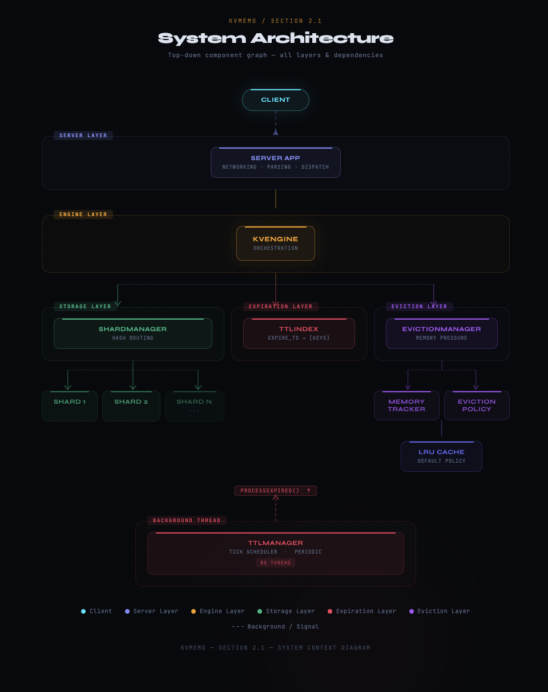
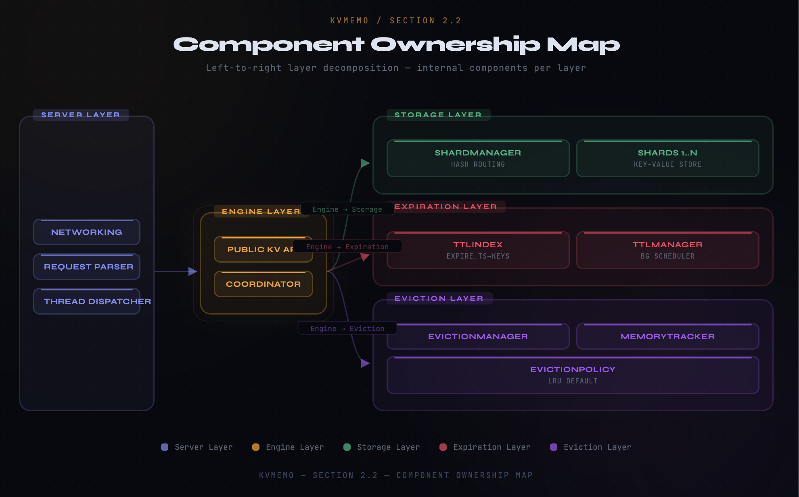
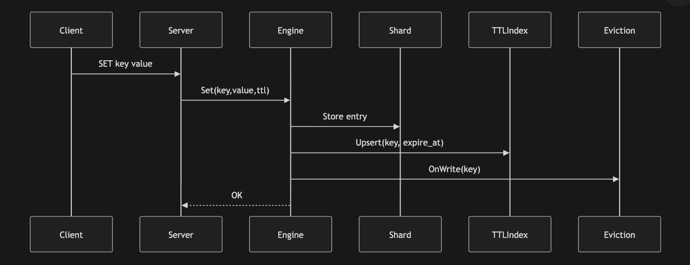
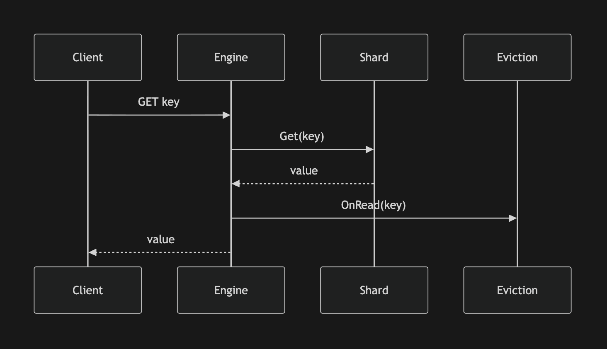
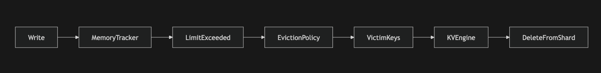
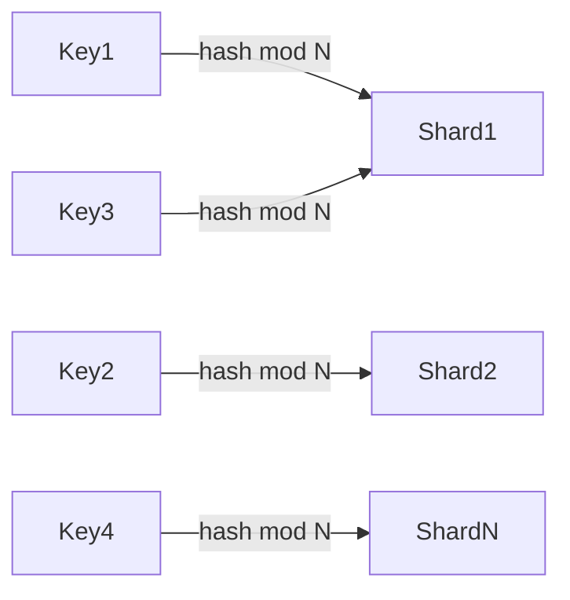
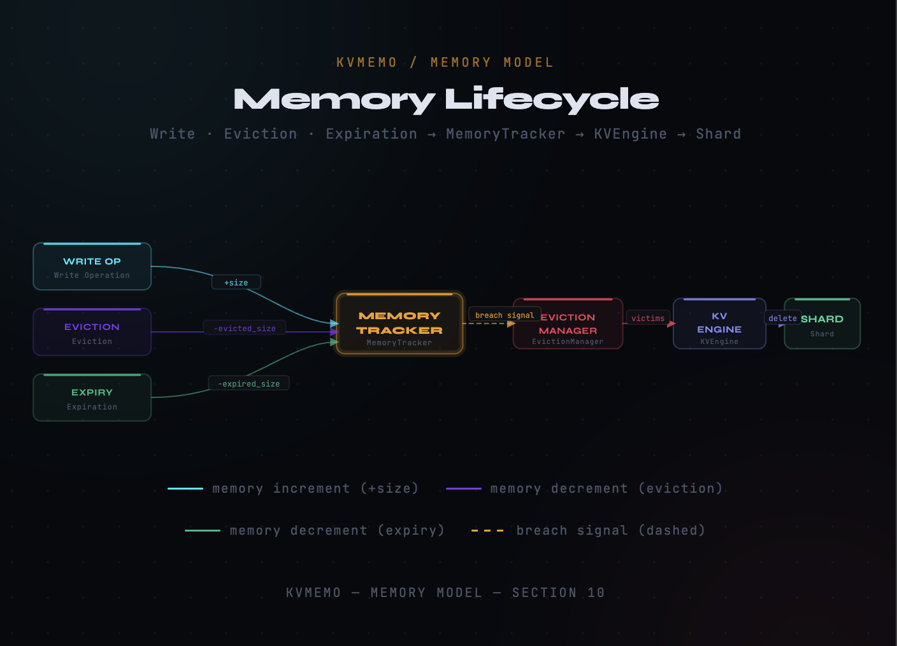
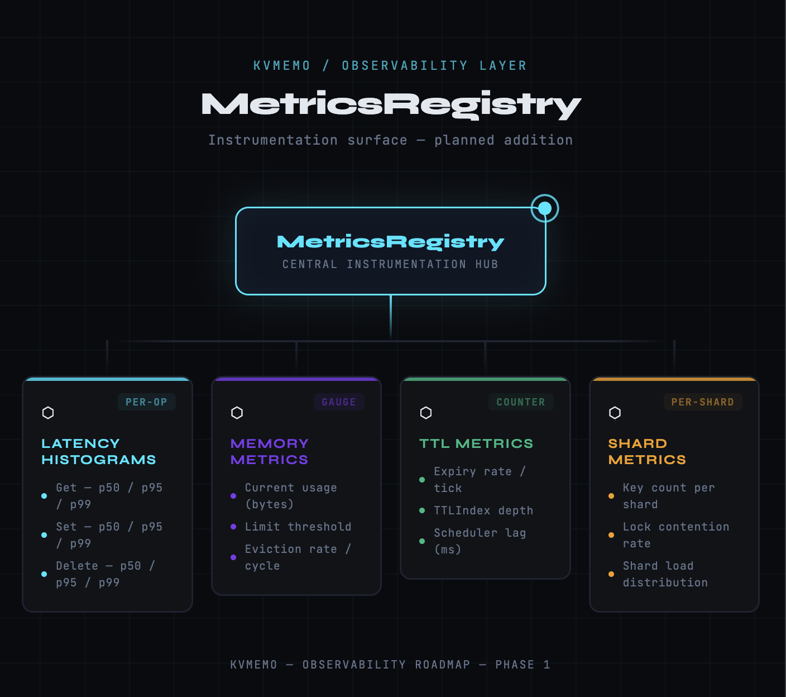

# KVMemo — High Level Design

> A production-grade, in-memory key-value storage engine with shard-based concurrency,
> TTL scheduling, and pluggable eviction policies.

---

## Table of Contents

1. [System Overview](#1-system-overview)
2. [Architecture](#2-architecture)
3. [Core Layers](#3-core-layers)
4. [Data Flows](#4-data-flows)
5. [Expiration Processing](#5-expiration-processing)
6. [Eviction Processing](#6-eviction-processing)
7. [Concurrency Model](#7-concurrency-model)
8. [Scalability Strategy](#8-scalability-strategy)
9. [Design Principles](#9-design-principles)
10. [Memory Model](#10-memory-model)
11. [Failure Isolation](#11-failure-isolation)
12. [Observability](#12-observability)
13. [Roadmap](#13-roadmap)

---

## 1. System Overview

KVMemo is a modular, in-memory key-value engine designed for high concurrency and long-term evolution. It is **not** a general-purpose database — it is a purpose-built storage primitive with a well-defined boundary between infrastructure concerns and core storage semantics.

**Core capabilities:**

- Shard-based parallelism with no global storage lock
- TTL expiration via a background scheduler
- Pluggable eviction policies (LRU by default)
- Clean separation of read, write, eviction, and expiration concerns
- SOLID-driven component boundaries

**Designed to evolve toward:**

- Distributed clustering with consistent hashing
- Write-ahead log and snapshot persistence
- Replication and failover
- Structured observability

---

## 2. Architecture

### 2.1 System Context

### 2.2 Component Ownership Map

---

## 3. Core Layers

### 3.1 Server Layer

Owns all network-facing concerns. Responsible for accepting connections, parsing protocol, and dispatching requests to the engine. It has **no knowledge of storage internals**.

| Responsibility | Owned |
|---|---|
| Networking / I/O | Yes |
| Request parsing | Yes |
| Thread management | Yes |
| Data storage | No |
| Eviction / TTL | No |

---

### 3.2 Engine Layer (`KVEngine`)

The central orchestrator. All public API calls (`Set`, `Get`, `Delete`) pass through here. It coordinates the storage, TTL, and eviction subsystems without implementing any of them directly.

> The engine is the boundary between infrastructure and core storage.

**Responsibilities:**

- Expose the public key-value API
- Route operations to the correct shard via `ShardManager`
- Register and revoke TTL entries in `TTLIndex`
- Trigger eviction candidate deletion after receiving victims from `EvictionManager`
- Execute `ProcessExpired()` when called by `TTLManager`

---

### 3.3 Storage Layer

#### ShardManager

Distributes keys across `N` shards using a hash function. Each shard is independently locked. There is no global storage lock.

- Consistent key routing by hash
- Horizontal scalability by shard count
- Isolated locking per shard

#### Shard

Each shard owns a local key-value map and manages its own mutex. Shard-level TTL cleanup operates independently.

---

### 3.4 Expiration Layer

#### TTLIndex

Maintains an ordered map of `expire_timestamp → [keys]`. Supports efficient range scans to collect all keys expired before a given instant.

#### TTLManager

A background thread that wakes periodically and calls `KVEngine::ProcessExpired()`. It does not delete keys — it triggers the engine to do so.

---

### 3.5 Eviction Layer

#### MemoryTracker

Tracks current memory usage against a configured limit. Signals pressure when the limit is exceeded.

#### EvictionPolicy

A strategy interface. The default implementation is LRU. The interface enables alternative policies (LFU, FIFO, Random) to be substituted without engine changes.

#### EvictionManager

Coordinates memory pressure response. When `MemoryTracker` signals pressure, `EvictionManager` selects victim keys and returns them to the engine for deletion. **It does not delete keys itself.**

---

## 4. Data Flows

### 4.1 SET Operation

---

### 4.2 GET Operation

---

## 5. Expiration Processing

TTL expiration is a background concern driven by `TTLManager`. It runs on a configurable tick interval.

**Ownership rule:** `TTLManager` schedules. `KVEngine` executes. `TTLIndex` tracks. No layer crosses these boundaries.

---

## 6. Eviction Processing

Memory pressure eviction follows the same clean ownership boundary as expiration.

> `EvictionManager` suggests victims. `KVEngine` executes deletion. Clean ownership. No cross-layer mutation.

---

## 7. Concurrency Model

KVMemo avoids a global storage lock entirely. Concurrency is achieved through:

| Mechanism | Scope | Notes |
|---|---|---|
| Shard mutex | Per shard | Readers and writers contend only within a shard |
| TTLIndex lock | Global (index only) | External synchronization required by callers |
| EvictionManager lock | Internal | Self-synchronized |
| Engine coordinator | Lock-free | Routes and coordinates; holds no data |

**Parallelism is proportional to shard count.** Two operations on keys that hash to different shards run fully in parallel. Increasing shard count decreases lock contention linearly.

---

## 8. Scalability Strategy

### 8.1 Current Model

- Hash-based key routing
- Independent per-shard locking
- Linear scalability with shard count

---

## 9. Design Principles

| Principle | Application |
|---|---|
| **SRP** | Each component has exactly one reason to change |
| **OCP** | `EvictionPolicy` is extensible without modifying `EvictionManager` |
| **LSP** | Any `EvictionPolicy` implementation is substitutable |
| **ISP** | Interfaces are narrow; callers depend only on what they use |
| **DIP** | `KVEngine` depends on manager abstractions, not concrete types |

---

## 10. Memory Model

Memory lifecycle is fully tracked and bounded:

No write can succeed without registering memory usage. No key can be removed without decrementing the tracker. This invariant prevents uncontrolled heap growth.

---

## 11. Failure Isolation

| Failure Scenario | Blast Radius | Containment |
|---|---|---|
| Shard corruption | Single shard | Other N-1 shards unaffected |
| TTLIndex inconsistency | Stale entries; no data loss | Periodic reconciliation (roadmap) |
| EvictionManager failure | Memory growth; no crash | Engine can bypass eviction path |
| TTLManager crash | Expired keys accumulate | Background thread is restartable |

**No component owns storage except Shard.** Cross-layer mutation is architecturally prevented by interface contracts.

---

## 12. Observability

Target instrumentation points:
- `KVEngine::Set` / `Get` / `Delete` — operation latency
- `EvictionManager::RequestEviction` — bytes freed per cycle
- `TTLManager::ProcessExpired` — keys expired per tick
- `MemoryTracker` — live usage vs. limit ratio

---

## 13. Roadmap

| Phase | Feature | Notes |
|---|---|---|
| 1 | Observability (MetricsRegistry) | Latency, memory, eviction metrics |
| 2 | Write-Ahead Log (WAL) | Durability on restart |
| 3 | Snapshot / RDB | Point-in-time backup |
| 4 | Replication | Primary / replica per shard group |
| 5 | Distributed cluster mode | Consistent hashing ring, partition rebalance |
| 6 | Multi-tier storage | Hot (memory) / warm (SSD) tiering |
| 7 | Compression | Per-value or per-shard compression |

---

## Summary

KVMemo is designed for correctness first, performance second, and extensibility throughout. The architecture enforces clear ownership at every layer:

- **Server** owns the wire
- **Engine** owns orchestration
- **ShardManager / Shard** own data
- **TTLIndex / TTLManager** own expiration
- **EvictionManager / EvictionPolicy** own memory pressure response

No layer mutates data it does not own. This constraint is the foundation for safe concurrency, failure isolation, and long-term extensibility.

web : https://kvmemo.vercel.app/