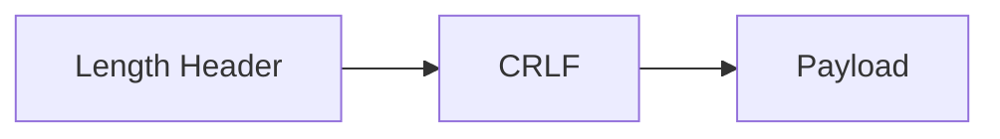
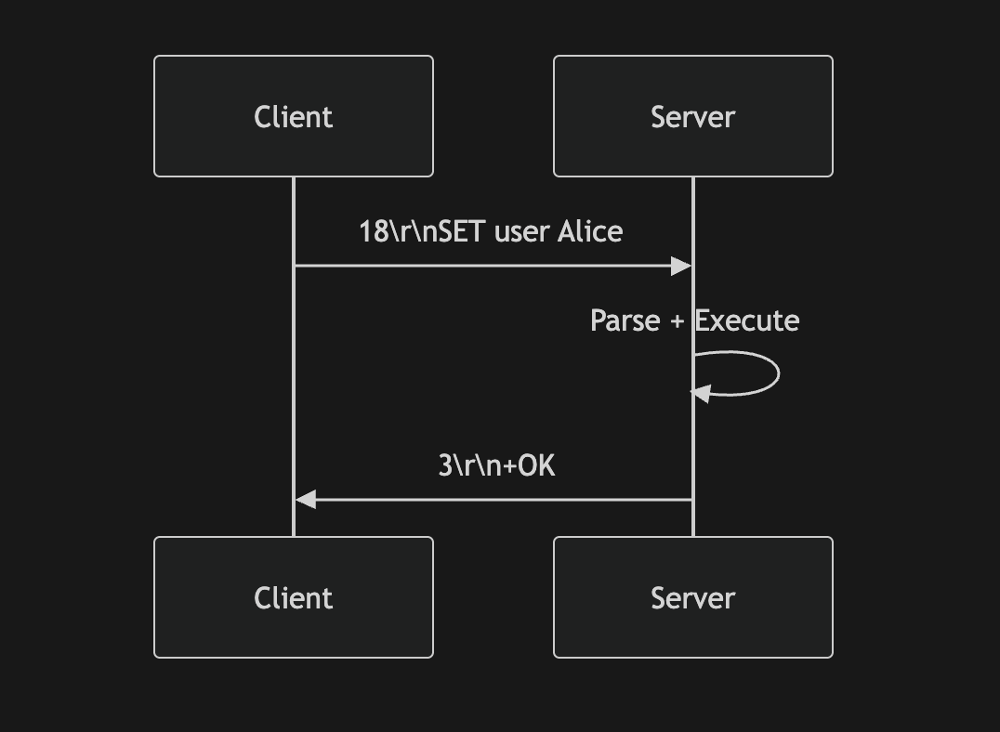
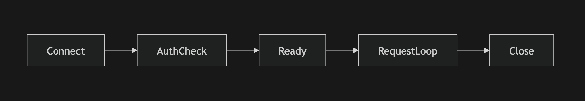

#  KVMemo Wire Protocol Specification

> Version: 1.0  
> Transport: TCP  
> Encoding: UTF-8 (text-based protocol)  
> Framing: Length-prefixed

---

# 1. Overview

KVMemo uses a lightweight, deterministic, length-prefixed request/response protocol over TCP.

The protocol is designed to be:

- Simple to implement
- Efficient to parse
- Human-readable
- Extensible
- Safe against partial reads
- Resistant to request boundary ambiguity

The protocol follows a strict:
> Client → Request

> Server → Response


No pipelining (v1.0).  
Requests are processed sequentially per connection.

---

# 2. Transport Layer

- Protocol runs over TCP
- Persistent connections supported
- One request → one response
- Server does not initiate messages

---

# 3. Message Framing

Each message is prefixed by its payload length.

Format:

> {length}\r\n

> {payload}


Where:

- `length` = number of bytes in payload
- `\r\n` = CRLF delimiter
- `payload` = command string

---

## Frame Structure Diagram



Example:
```
23\r\n
SET mykey hello world
```

Meaning:

Payload length = 23 bytes

Payload = SET mykey hello world

---

# 4. Command Grammar

All commands are ASCII uppercase.

Arguments are space-separated.

General format :
```
COMMAND arg1 arg2 arg3 ...
```

---


# 5. Supported Commands (v1.0)
### 5.1 SET

Stores a key-value pair.

```
SET <key> <value>
```
With TTL:
```
SET <key> <value> PX <ttl_ms>
```
Example
```
SET user:1 Alice
SET session:abc data PX 60000
```

### 5.2 GET

Retrieve value for key.

GET <key>
Example
```
GET user:1
```

### 5.3 DEL

Delete key.

```
DEL <key>
```

---

# 6. Full Request/Response Flow



---

# 7. Expiration Semantics

If a key has expired:
- It behaves as non-existent
- GET returns $-1
- EXISTS returns 0

Expiration cleanup is handled internally by TTL manager.

Protocol does not expose expiration timestamps.

# 8. Error Handling Rules

Server returns -ERR in cases of:
- Invalid command
- Invalid argument count
- Malformed frame
- Invalid TTL
- Internal failure

Malformed framing results in connection termination.

--- 

# 9. Connection Lifecycle



In v1.0:
1. No authentication
2. No multi-command transaction
3. No pipelining

--- 

# 10. Partial Read Handling

Because protocol is length-prefixed:
- Server reads header
- Parses length
- Reads exact payload size
- Processes message

This prevents:
- Command boundary ambiguity
- Injection via newline
- Split-frame errors

# 11. Example Session
```
Client: 21\r\nSET user:1 Alice
Server: 3\r\n+OK

Client: 13\r\nGET user:1
Server: 8\r\n$5\r\nAlice

Client: 13\r\nDEL user:1
Server: 3\r\n+OK

Client: 13\r\nGET user:1
Server: 4\r\n$-1
```

--- 

# 12. Design Rationale
Why length-prefixed?
> Avoids ambiguity of line-based protocols.

Why text-based?
 - Easier debugging
 - Human-readable
 - Telnet-compatible
 - Faster prototyping

Why not JSON?
- Overhead
- Unnecessary parsing cost
- Inefficient for high-throughput KV engines

--- 

# 13. Versioning Strategy

Future protocol versions will:
1. Maintain backward compatibility
2. Negotiate version during handshake
3. Add feature flags